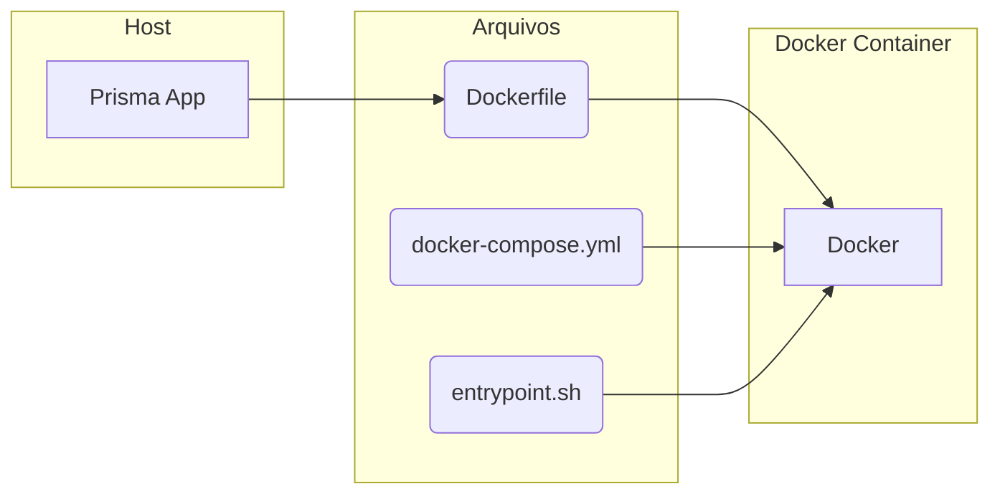
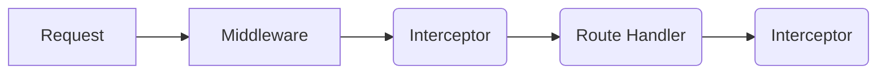

# NestJS - Prisma - Postgres

### Docker w/ Prisma tree



## Create

```bash
nest new prisma-api
```

### Dependencies

```bash
npm i --save @nestjs/core @nestjs/common rxjs reflect-metadata @nestjs/config
```

### Docker File

```Dockerfile
FROM node:lts-alpine

RUN apk add --no-cache bash

RUN npm install -g @nestjs/cli

USER node

WORKDIR /home/node/app

```

### Docker File (Postgres)

```Dockerfile
FROM postgres

RUN usermod -u 1000 postgres
```

### Docker Entrypoint

```sh
#!/bin/sh

npm install
npm run build
npm run start:dev

```

### Docker Compose

```yml
version: '3'

services:
  app:
    build: .
    entrypoint: .docker/entrypoint.sh
    container_name: prismaapi-app
    ports:
      - "3000:3000"
    volumes:
      - .:/home/node/app
    depends_on:
      - db

  db:
    build: .docker/postgres
    container_name: prismaapi-db
    restart: always
    tty: true
    ports:
      - "5432:5432"
    volumes:
      - .docker/dbdata:/var/lib/postgresql/data && sudo chmod 0700 /var/lib/postgresql/data
    environment:
      - POSTGRES_PASSWORD=docker
      - POSTGRES_DB=prismaapi

```

## Install Prisma in Docker Compose

**Init docker bash**

```bash
 docker compose exec app bash
```

**Install Prisma in Container**

```bash
 npm install prisma -D
```

**Init Prisma in Container**

```bash
npx pisma init
```

This will create a prisma folder in root directory and change your .env file setting up a default DATABASE_URL.
Then will need to change to your **Database** settings.

###### Example

.env file

```shell
NODE_ENV=development
PORT=3000

# This was inserted by `prisma init`:
# Environment variables declared in this file are automatically made available to Prisma.
# See the documentation for more detail: https://pris.ly/d/prisma-schema#accessing-environment-variables-from-the-schema

# Prisma supports the native connection string format for PostgreSQL, MySQL, SQLite, SQL Server, MongoDB and CockroachDB.
# See the documentation for all the connection string options: https://pris.ly/d/connection-strings

DATABASE_URL="postgresql://postgres:docker@db:5432/prismaapi?schema=public" # Change here

```

## Migration

### Inside the container shell

```shell
npx prisma migrate dev --name init
```

*This will create the folder migration and the SQL file.*

## Generating Prisma Service

### Inside the container shell

```shell
nest g service prisma
```

prisma.service.ts

```ts
import { Injectable, OnModuleInit } from '@nestjs/common';
import { PrismaClient } from '@prisma/client';

@Injectable()
export class PrismaService extends PrismaClient implements OnModuleInit {
  async onModuleInit() {
    await this.$connect();
  }
}

```

## Creating Prisma Studio

### docker-compose

Setting up the prisma studio default port

```yml
version: '3'

services:
  app:
    build: .
    entrypoint: .docker/entrypoint.sh
    container_name: prismaapi-app
    ports:
      - "3000:3000"
      - "5555:5555" # Add here the new Port
    volumes:
      - .:/home/node/app
    depends_on:
      - db

  db:
    build: .docker/postgres
    container_name: prismaapi-db
    restart: always
    tty: true
    ports:
      - "5432:5432"
    volumes:
      - .docker/dbdata:/var/lib/postgresql/data && sudo chmod 0700 /var/lib/postgresql/data
    environment:
      - POSTGRES_PASSWORD=docker
      - POSTGRES_DB=prismaapi

```

### Inside the container shell

```shell
npx prisma studio
```

Enter your 5555 port to see if its running!


## CRUD

### Generating Users Resource

docker sheel:

```shell
nest g res users
```

_ REST API

### Installing Class-Validator && Class-Tranformer

docker sheel:

```shell
npm install class-validator class-transf
ormer
```

### Remove PrismaService from AppModule

```ts
import { Module } from '@nestjs/common';
import { AppController } from './app.controller';
import { AppService } from './app.service';
import { ConfigModule } from '@nestjs/config';
import { UsersModule } from './users/users.module';

@Module({
  imports: [ConfigModule.forRoot(), UsersModule],
  controllers: [AppController],
  providers: [AppService],
})
export class AppModule {}
```

### Put the PrismaService inside UserModule

```ts
import { Module } from '@nestjs/common';
import { UsersService } from './users.service';
import { UsersController } from './users.controller';
import { PrismaService } from 'src/prisma/prisma.service';

@Module({
  controllers: [UsersController],
  providers: [UsersService, PrismaService],
})
export class UsersModule {}
```

### In main.ts create the Validation Pipe

```ts
import { NestFactory } from '@nestjs/core';
import { AppModule } from './app.module';
import { ValidationPipe } from '@nestjs/common';

async function bootstrap() {
  const app = await NestFactory.create(AppModule);
  app.useGlobalPipes(
    new ValidationPipe({
      whitelist: true,
      forbidNonWhitelisted: true,
      transform: true,
    }),
  );
  await app.listen(process.env.PORT || 3000);
}
bootstrap();
```

### Class validator in create-user.dto

```ts
import { IsEmail, IsString, IsBoolean, IsNotEmpty } from 'class-validator';

export class CreateUserDto {
  @IsEmail()
  @IsNotEmpty()
  email: string;

  @IsString()
  @IsNotEmpty()
  name: string;

  @IsBoolean()
  admin: boolean;
}
```

### Creating UserRepo

users/repositories/users.repository.ts

```ts
import { Injectable } from '@nestjs/common';
import { PrismaService } from 'src/prisma/prisma.service';
import { CreateUserDto } from '../dto/create-user.dto';
import { UpdateUserDto } from '../dto/update-user.dto';
import { UserEntity } from '../entities/user.entity';

@Injectable()
export class UsersRepository {
  constructor(private readonly prisma: PrismaService) {}

  async create(createUserDto: CreateUserDto): Promise<UserEntity> {
    return this.prisma.user.create({
      data: createUserDto,
    });
  }

  async findAll(): Promise<UserEntity[]> {
    return await this.prisma.user.findMany();
  }

  async findOne(id: number): Promise<UserEntity> {
    return this.prisma.user.findUnique({
      where: {
        id,
      },
    });
  }

  async update(id: number, updateUserDto: UpdateUserDto): Promise<UserEntity> {
    return this.prisma.user.update({
      where: {
        id,
      },
      data: updateUserDto,
    });
  }

  async remove(id: number): Promise<UserEntity> {
    return this.prisma.user.delete({
      where: {
        id,
      },
    });
  }
}
```

### Updating UserService && UserModule

users/users.service.ts

```ts
import { Injectable } from '@nestjs/common';
import { CreateUserDto } from './dto/create-user.dto';
import { UpdateUserDto } from './dto/update-user.dto';
import { UsersRepository } from './repositories/users.repository';

@Injectable()
export class UsersService {
  constructor(private readonly usersRepository: UsersRepository) {}

  create(createUserDto: CreateUserDto) {
    return this.usersRepository.create(createUserDto);
  }

  findAll() {
    return this.usersRepository.findAll();
  }

  findOne(id: number) {
    return this.usersRepository.findOne(id);
  }

  update(id: number, updateUserDto: UpdateUserDto) {
    return this.usersRepository.update(id, updateUserDto);
  }

  remove(id: number) {
    return this.usersRepository.remove(id);
  }
}
```

\
users/users.module.ts

```ts
import { Module } from '@nestjs/common';
import { UsersService } from './users.service';
import { UsersController } from './users.controller';
import { PrismaService } from 'src/prisma/prisma.service';
import { UsersRepository } from './repositories/users.repository';

@Module({
  controllers: [UsersController],
  providers: [UsersService, PrismaService, UsersRepository],
})
export class UsersModule {}
```

After that config, the basic CRUD is complete. \
Helpful shell commands:

- npx prisma migrate dev
- docker compose up

## Exceptions Filters



## Unauthorized Exception

### Generate HttpException Filter

common/filters/http-exception.filter.ts

```ts
import {
  ArgumentsHost,
  Catch,
  ExceptionFilter,
  HttpException,
} from '@nestjs/common';
import { Response } from 'express';

@Catch(HttpException)
export class HttpExceptionFilter<T extends HttpException>
  implements ExceptionFilter
{
  catch(exception: T, host: ArgumentsHost) {
    const ctx = host.switchToHttp();
    const response = ctx.getResponse<Response>();

    const status = exception.getStatus();
    const exceptionResponse = exception.getResponse();

    const error =
      typeof response === 'string'
        ? { message: exceptionResponse }
        : (exceptionResponse as object);

    response.status(status).json({
      ...error,
      timestamp: new Date().toISOString(),
    });
  }
}
```

### Creating Error Files

common/errors/types/UnauthorizedError.ts

```ts
export class UnauthorizedError extends Error {}
```

### Creating Interceptor Files

common/erros/interceptors/UnauthorizedError.interceptor.ts

```ts
import {
  Injectable,
  NestInterceptor,
  ExecutionContext,
  CallHandler,
  UnauthorizedException,
} from '@nestjs/common';
import { catchError, Observable } from 'rxjs';
import { UnauthorizedError } from '../types/UnauthorizedError';

@Injectable()
export class UnauthorizedInterceptor implements NestInterceptor {
  intercept(context: ExecutionContext, next: CallHandler): Observable<any> {
    return next.handle().pipe(
      catchError(error => {
        if (error instanceof UnauthorizedError) {
          throw new UnauthorizedException(error.message);
        } else {
          throw error;
        }
      }),
    );
  }
}
```

### Add the Interceptor in Global Pipe

main.ts

```ts
import { NestFactory } from '@nestjs/core';
import { AppModule } from './app.module';
import { ValidationPipe } from '@nestjs/common';
import { UnauthorizedInterceptor } from './common/errors/interceptors/unauthorized.interceptor';

async function bootstrap() {
  const app = await NestFactory.create(AppModule);
  app.useGlobalPipes(
    new ValidationPipe({
      whitelist: true,
      forbidNonWhitelisted: true,
      transform: true,
    }),
  );
  //app.useGlobalFilters(new HttpExceptionFilter());
  app.useGlobalInterceptors(new UnauthorizedInterceptor());
  await app.listen(process.env.PORT || 3000);
}
bootstrap();
```

Now the UnauthorizedInterceptor is complete.

## NotFound Exception

### Creating Error Files

common/errors/types/NotFoundError.ts

```ts
export class NotFoundError extends Error {}
```

### Creating Interceptor Files

common/errors/interceptors/notfound.interceptor.ts

```ts
import {
  Injectable,
  NestInterceptor,
  ExecutionContext,
  CallHandler,
  NotFoundException,
} from '@nestjs/common';
import { catchError, Observable } from 'rxjs';
import { NotFoundError } from '../types/NotFoundError';

@Injectable()
export class NotFoundInterceptor implements NestInterceptor {
  intercept(context: ExecutionContext, next: CallHandler): Observable<any> {
    return next.handle().pipe(
      catchError(error => {
        if (error instanceof NotFoundError) {
          throw new NotFoundException(error.message);
        } else {
          throw error;
        }
      }),
    );
  }
}
```

### Add the Interceptor in Global Pipe

main.ts

```ts
import { NestFactory } from '@nestjs/core';
import { AppModule } from './app.module';
import { ValidationPipe } from '@nestjs/common';
import { NotFoundInterceptor } from './common/errors/interceptors/notfound.interceptor';
import { UnauthorizedInterceptor } from './common/errors/interceptors/unauthorized.interceptor';

async function bootstrap() {
  const app = await NestFactory.create(AppModule);
  app.useGlobalPipes(
    new ValidationPipe({
      whitelist: true,
      forbidNonWhitelisted: true,
      transform: true,
    }),
  );
  //app.useGlobalFilters(new HttpExceptionFilter());
  app.useGlobalInterceptors(new UnauthorizedInterceptor());
  app.useGlobalInterceptors(new NotFoundInterceptor());
  await app.listen(process.env.PORT || 3000);
}
bootstrap();
```

Now the NotFoundException is complete.

## Database Exception

List of Prisma Errors:
[Prisma - Errors Reference](https://www.prisma.io/docs/reference/api-reference/error-reference#error-codes) \
How to handle Prisma Errors:
[Prisma - Handling Errors](https://www.prisma.io/docs/concepts/components/prisma-client/handling-exceptions-and-errors)

To create a *database exception* follow the same steps of Unauthorized and NotFound exceptions:

- Create error class
- Create interceptor class
- Update main.ts with GlobalPipes <= Interceptor class

Then, create a condition to see if the error is as PrismaError, and a type PrismaClientError.

common/errors/types/PrismaClientError.ts

```ts
import { PrismaClientKnownRequestError } from '@prisma/client/runtime/library';

export type PrismaClientError = PrismaClientKnownRequestError & {
  meta?: { target: string };
};
```

\
common/utils/is-prisma-error.util.ts

```ts
import { PrismaClientError } from '../errors/types/PrismaClientError';

export const isPrismaError = (e: PrismaClientError) => {
  return (
    typeof e.code === 'string' &&
    typeof e.clientVersion === 'string' &&
    (typeof e.meta === 'undefined' || typeof e.meta === 'object')
  );
};
```

Now implement that condition you create in database.interceptor.ts
