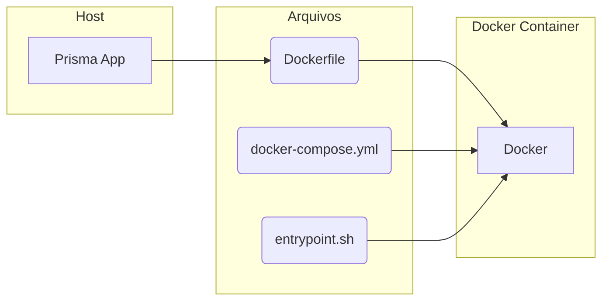

# Overview

### Docker w/ Prisma tree



# Create

```bash
nest new prisma-api
```

### Dependencies

```bash
npm i --save @nestjs/core @nestjs/common rxjs reflect-metadata @nestjs/config
```

### Docker File

```Dockerfile
FROM node:lts-alpine

RUN apk add --no-cache bash

RUN npm install -g @nestjs/cli

USER node

WORKDIR /home/node/app

```

### Docker File (Postgres)

```Dockerfile
FROM postgres

RUN usermod -u 1000 postgres
```

### Docker Entrypoint

```sh
#!/bin/sh

npm install
npm run build
npm run start:dev

```

### Docker Compose

```yml
version: '3'

services:
  app:
    build: .
    entrypoint: .docker/entrypoint.sh
    container_name: prismaapi-app
    ports:
      - "3000:3000"
    volumes:
      - .:/home/node/app
    depends_on:
      - db

  db:
    build: .docker/postgres
    container_name: prismaapi-db
    restart: always
    tty: true
    ports:
      - "5432:5432"
    volumes:
      - .docker/dbdata:/var/lib/postgresql/data && sudo chmod 0700 /var/lib/postgresql/data
    environment:
      - POSTGRES_PASSWORD=docker
      - POSTGRES_DB=prismaapi

```

# Install Prisma in Docker Compose

**Init docker bash**

```bash
 docker compose exec app bash
```

**Install Prisma in Container**

```bash
 npm install prisma -D
```

**Init Prisma in Container**

```bash
npx pisma init
```

This will create a prisma folder in root directory and change your .env file setting up a default DATABASE_URL.
Then will need to change to your **Database** settings.

###### Example

.env file

```shell
NODE_ENV=development
PORT=3000

# This was inserted by `prisma init`:
# Environment variables declared in this file are automatically made available to Prisma.
# See the documentation for more detail: https://pris.ly/d/prisma-schema#accessing-environment-variables-from-the-schema

# Prisma supports the native connection string format for PostgreSQL, MySQL, SQLite, SQL Server, MongoDB and CockroachDB.
# See the documentation for all the connection string options: https://pris.ly/d/connection-strings

DATABASE_URL="postgresql://postgres:docker@db:5432/prismaapi?schema=public" # Change here

```

# Migration

### Inside the container shell

```shell
npx prisma migrate dev --name init
```

*This will create the folder migration and the SQL file.*

# Generating Prisma Service

### Inside the container shell

```shell
nest g service prisma
```

prisma.service.ts

```ts
import { Injectable, OnModuleInit } from '@nestjs/common';
import { PrismaClient } from '@prisma/client';

@Injectable()
export class PrismaService extends PrismaClient implements OnModuleInit {
  async onModuleInit() {
    await this.$connect();
  }
}

```

# Creating Prisma Studio

### docker-compose

Setting up the prisma studio default port

```yml
version: '3'

services:
  app:
    build: .
    entrypoint: .docker/entrypoint.sh
    container_name: prismaapi-app
    ports:
      - "3000:3000"
      - "5555:5555" # Add here the new Port
    volumes:
      - .:/home/node/app
    depends_on:
      - db

  db:
    build: .docker/postgres
    container_name: prismaapi-db
    restart: always
    tty: true
    ports:
      - "5432:5432"
    volumes:
      - .docker/dbdata:/var/lib/postgresql/data && sudo chmod 0700 /var/lib/postgresql/data
    environment:
      - POSTGRES_PASSWORD=docker
      - POSTGRES_DB=prismaapi

```

### Inside the container shell

```shell
npx prisma studio
```

Enter your 5555 port to see if its running!


# CRUD

### Generating Users Resource

docker sheel:

```shell
nest g res users
```

_ REST API

### Installing Class-Validator && Class-Tranformer

docker sheel:

```shell
npm install class-validator class-transf
ormer
```

### Remove PrismaService from AppModule

```ts
import { Module } from '@nestjs/common';
import { AppController } from './app.controller';
import { AppService } from './app.service';
import { ConfigModule } from '@nestjs/config';
import { UsersModule } from './users/users.module';

@Module({
  imports: [ConfigModule.forRoot(), UsersModule],
  controllers: [AppController],
  providers: [AppService],
})
export class AppModule {}
```

### Put the PrismaService inside UserModule

```ts
import { Module } from '@nestjs/common';
import { UsersService } from './users.service';
import { UsersController } from './users.controller';
import { PrismaService } from 'src/prisma/prisma.service';

@Module({
  controllers: [UsersController],
  providers: [UsersService, PrismaService],
})
export class UsersModule {}
```

### In main.ts create the Validation Pipe

```ts
import { NestFactory } from '@nestjs/core';
import { AppModule } from './app.module';
import { ValidationPipe } from '@nestjs/common';

async function bootstrap() {
  const app = await NestFactory.create(AppModule);
  app.useGlobalPipes(
    new ValidationPipe({
      whitelist: true,
      forbidNonWhitelisted: true,
      transform: true,
    }),
  );
  await app.listen(process.env.PORT || 3000);
}
bootstrap();
```

### Class validator in create-user.dto

```ts
import { IsEmail, IsString, IsBoolean, IsNotEmpty } from 'class-validator';

export class CreateUserDto {
  @IsEmail()
  @IsNotEmpty()
  email: string;

  @IsString()
  @IsNotEmpty()
  name: string;

  @IsBoolean()
  admin: boolean;
}
```
